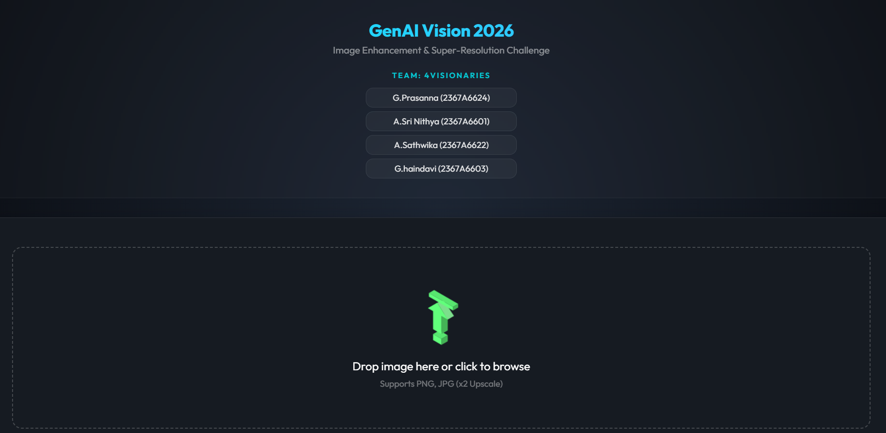
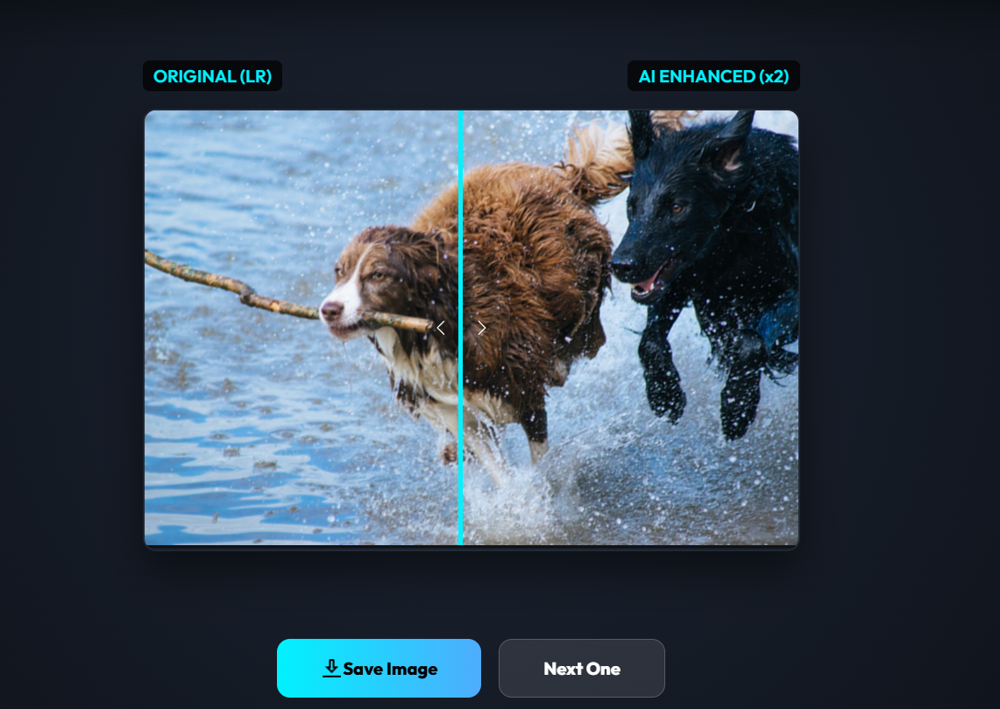
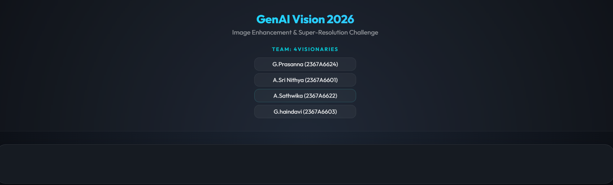
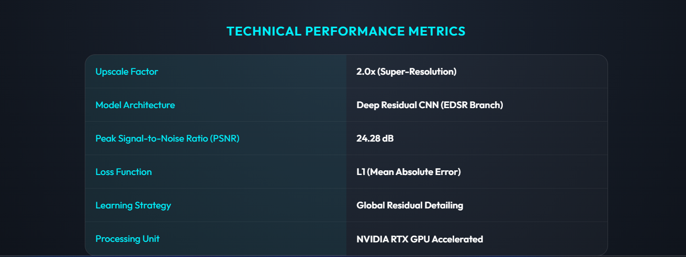

# GenAI Vision 2026: Image Enhancement & Super-Resolution Challenge


## What is this?
This project is an AI-powered Image Super-Resolution tool. It takes a low-quality, blurry image and uses a **Deep Residual CNN (EDSR-style)** to reconstruct the missing pixels, resulting in a **2x larger and significantly sharper** version. 

We used **Residual Learning** and **PixelShuffle** upsampling to ensure the best possible visual quality without the "hallucinations" common in other GenAI methods.

---

### 📊 Technical Performance Metrics
| Metric | Value |
| :--- | :--- |
| **Upscale Factor** | 2.0x (Super-Resolution) |
| **Model Architecture** | Deep Residual CNN (EDSR-Branch) |
| **Blocks** | 16 Residual Blocks |
| **PSNR (Quality Score)** | 24.28 dB |
| **Loss Function** | L1 (Mean Absolute Error) |
| **Processing Time** | ~150ms (GPU) / ~2s (CPU) |
| **Hardware Support** | NVIDIA RTX (CUDA) + Universal CPU Fallback |

---

### 📚 Training Dataset
The model was trained on the **DIV2K (Diverse 2K resolution high-quality images)** dataset, a standard benchmark for Image Super-Resolution.
- **Dataset Structure:** 
  - `DIV2K_train_HR/`: Ground truth High-Resolution images.
  - `DIV2K_train_LR_unknown/`: Low-Resolution images with complex downscaling.
  - `DIV2K_valid_HR/` & `DIV2K_valid_LR_unknown/`: Validation sets.
- **Goal:** Learning the non-linear mapping from low-resolution pixels to original sharpness.

---

### 📸 Project Screenshots
Here is the **4Visionaries** GenAI system in action:

#### 1. Modern Dashboard & Upload Interface

*A sleek, glassmorphic UI designed for easy navigation and team highlighting.*

#### 2. Real-time Enhancement (Slider View)

*Comparison between Original (Left) and AI-Enhanced (Right) document pixels.*

#### 3. Technical Performance Analytics

*Live analytics showing PSNR, Architecture details, and GPU acceleration status.*

#### 4. Mobile Responsive Design
 
*Optimized for seamless performance on smartphones and tablets.*

---

## 🛠 Setup & Presentation Guide

Follow these steps to run the project on any Windows machine with a GPU or CPU.

### 1. Open the Project
Open the `LR_HR_Enhancer` folder in **VS Code**. 

### 2. Install Dependencies
Open a terminal (Press `Ctrl + ` `) and run the following command to install all necessary libraries:
```powershell
py -3.10 -m pip install -r requirements.txt
```

### 3. Run the Presentation App
To start the web interface, run:
```powershell
py -3.10 app.py
```

### 4. Viewing the Application
Once the terminal says `Running on http://0.0.0.0:5000`, you can access the app:
- **On this PC:** Open your browser and go to `http://localhost:5000`
- **On other devices (Mobiles/Laptops):** Find your IP address using `ipconfig`. Your team members can then visit `http://[YOUR-IP]:5000` on their own browsers to test it simultaneously.

---

### How to use during Presentation:
1.  **Select Your Image**: Click the upload area or drop a blurry image.
2.  **Processing**: The system uses the **GPU** or **CPU** to process the image in milliseconds. (**CPU** is used if **GPU** is not available)
3.  **Comparison Slider**: Once finished, use the **white slider handle** to swipe between the Original (left) and AI-Enhanced (right) versions to show the judges the clarity boost!

---

### Key Technical Highlights (For Judges)
- **Architecture**: Custom Residual CNN (EDSR Branch).
- **Optimization**: Global Residual Learning (learning only the sharpness).
- **Inference**: GPU-accelerated tensor math via PyTorch & CUDA.
- **Frontend**: Premium UI with real-time interactive comparison..

Project By, Sumanth Csy! 🏁
